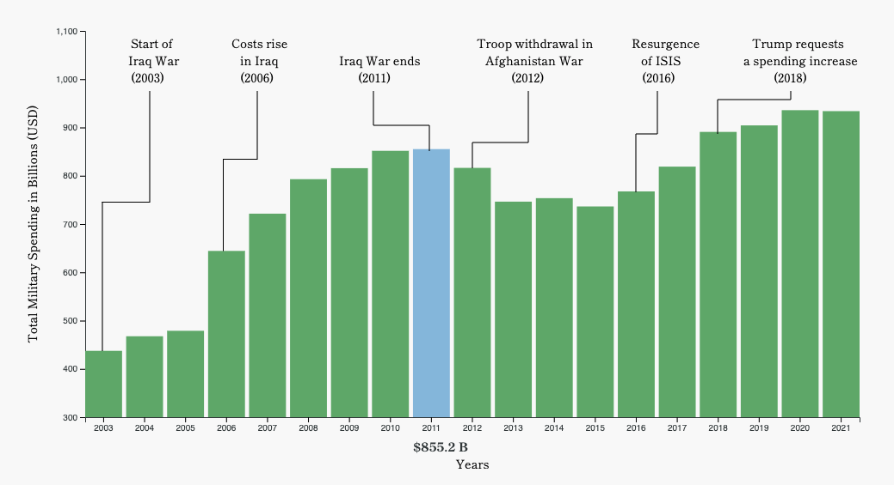
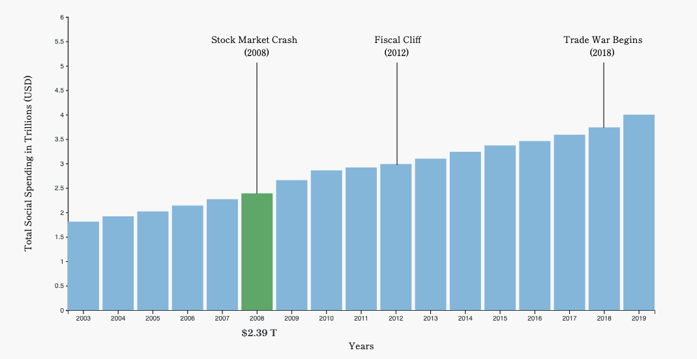
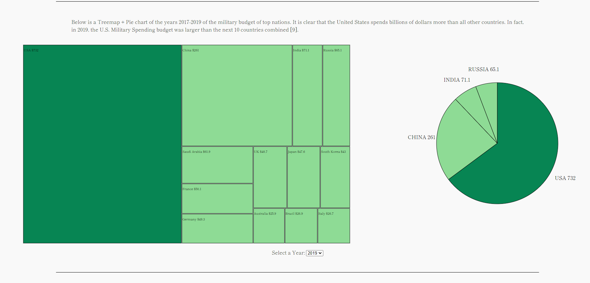
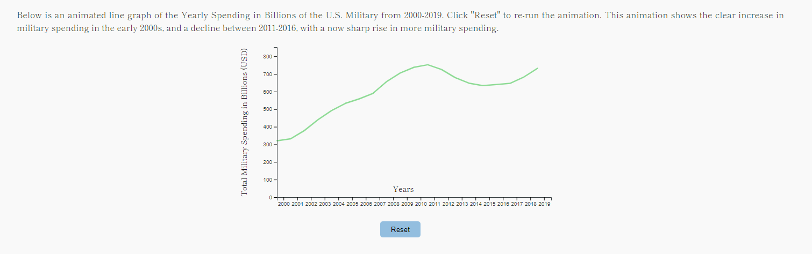
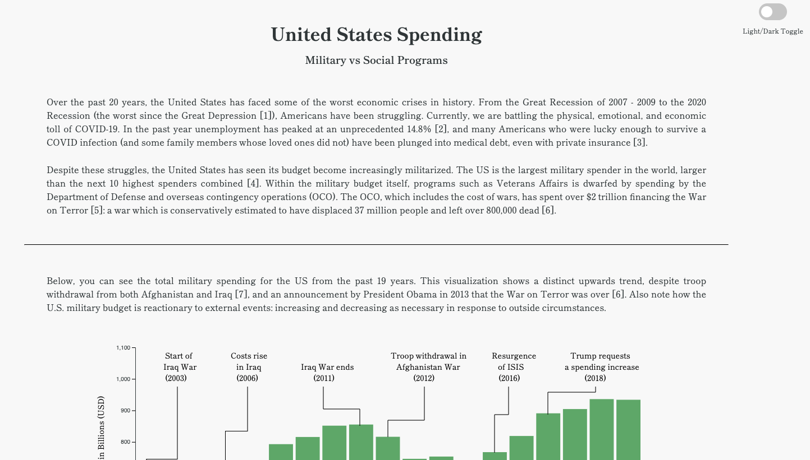
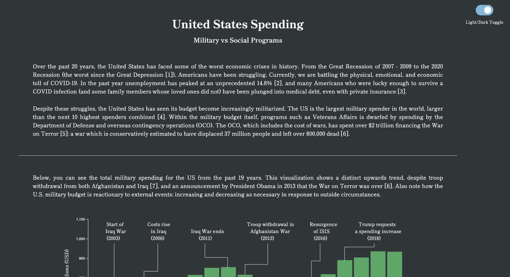
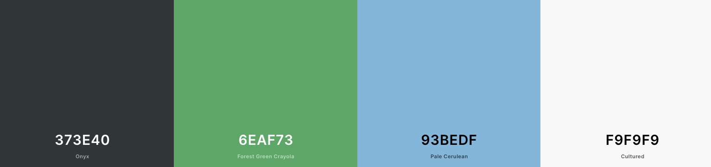

# Final Project - Interactive Data Visualization
#### Danya Baron, Roman Wicky van Doyer, Molly Wirtz

### Project Website

https://romanwicky.github.io/final/index.html

### Screencast Video

Background
---

### Objective
Given the unprecedented economic upheaval of the past year brought on by the pandemic, our team wanted to choose a project focusing on the financial spending of the government: specifically the difference between how the U.S. spends money on military endeavors versus social programs. 

### Data
We sifted through multiple databases and other data sources to find the information necessary for our project. We changed courses a few times based on much data was available, how specific it was, and the points we were trying to convey to our reader. Although not all of the following data sources are represented in our final version, all of them were helpful in our research and understanding of this topic. 

<a href="https://www.sipri.org/databases/milex">SIPRI</a> 
<a href="https://www.oecd.org/social/expenditure.htm">OECD</a> 
<a href="https://www.thebalance.com/u-s-military-budget-components-challenges-growth-3306320">The Balance</a> 
<a href="https://www.usgovernmentrevenue.com/download">US Government Revenue</a> 

For most of our data we had to employ some about of cleaning. This involving downloading spreadsheets or CSV files, selecting the data we wished to use, and converting into our desired format (JSON). 

Visualizations
---
Our project website contains multiple sections. First, we felt it was important to convey our objectives for this project, as well as provide explanations of our visualizations and additional research to our user. This is shown at the top of our page in the form of an introduction. 

Next we have our section on U.S. military spending, featuring a bar chart. The bar chart shows data on the total military spending from 2003 - 2021 (2021 projected). Important events, such of the start or end of wars, are denoted to give the user an informed idea of global events that impacted spending. To clarify and emphasize the y-values, the cost of each year is displayed under the x-axis when that bar is hovered on. 

Our next section focuses on U.S. social spending, and like the military section, also contains a bar graph. The bar chart shows the total spending of the U.S. government on social programs, such as social security, education, and healthcare. Events that significantly impacted Americans financial state, such as the 2008 stock market crash, have been donated above the years they occur, similarly to our other bar graph. This graph also made to be interactive by changing color and showing the cost per year of the bar when hovered on. 

The next section features a treemap with an accompanying pie chart showing the spread of military spending from the years 2017 to 2019 in comparison to other countries. Users can select a year, and it will update the pie chart and treemap accordingly. These visualizations are important because they give a reference to the amount the US spends compared to several other top-spending countries, putting the data shown in the above bar charts into perspective for the user. 

The final section features a line graph of the U.S. military spending by year from 2000 to 2019. This is a variation on the first bar chart, with an animated line emphasizing the climb of military spending over the past two decades. Clicking "Reset" will restart the animation.

Code
---
The majority of our code can be found in our backend.js file, which is commented and organized by graph and feature. 

### Libraries
We did not use any additional libraries for this project, apart from d3 and Google Fonts.

### Additional Features
As an additional feature, we have an optional light / dark theme, which users can toggle using the switch in the upper right corner. These themes, which are true to our color palette, allow the user to interact with our site in a unique way, and includes a gentle CSS transition. All parts of this page comply to selected theme, including the d3 elements. Below are examples of this light/dark option. 

Achievements
---
### Design
- Consistently used a color scheme appropriate to the subject matter, as researched with resource 1

### Technical
- Implemented a light / dark theme option using CSS and a stylized input checkbox located in the top right corner of the page (further detail and images are included in the features section)
- Created interactive bar charts, changing colors of bars and including the amounts on each hover
- Made a  treemap to display the scale of how much more the U.S. spends
- Made a Treemap and Pie chart that is updated from a selection dropdown
- Created an animated line graph that resets when "Reset" button is clicked

Resources
---
[1] https://visme.co/blog/how-to-choose-a-color-scheme/  
[2] https://www.w3schools.com/howto/howto_css_switch.asp  
[3] https://www.sipri.org/databases/milex 
[4] https://www.oecd.org/social/expenditure.htm> 
[5] https://www.thebalance.com/u-s-military-budget-components-challenges-growth-3306320 
[6] https://www.usgovernmentrevenue.com/downloadbr>