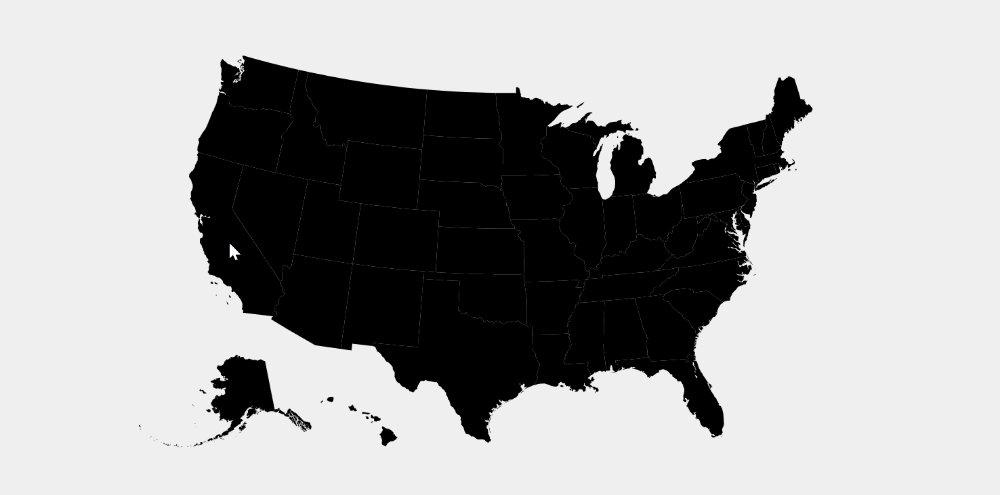
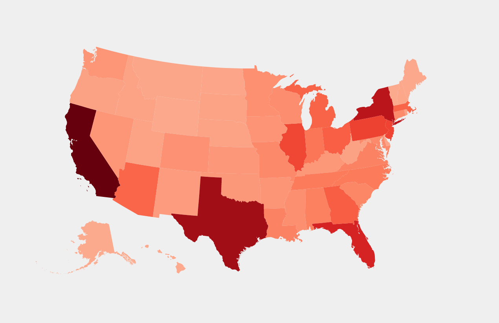

Final Project - Interactive Data Visualization  
===

Project Web Link: https://covid-info-charts.herokuapp.com/

Video Link: https://www.youtube.com/watch?v=wl0E-ehkwyc

Our final project aims to analyze data about Covid-19 by
creating our own visualizations including brush views, pie
chart, bar charts, bubble charts and map. Our findings is that
as time goes by, the total death numbers are keeping increasing,
The total number of new cases tested positive for each
month is generally at thea peak in 2020 Dec and falls a lot
in 2021. In some states that there are a lot of people, for
example California and Florida, the numbers of airports per 1000 
people are low but the death rates are high.

Here is the link to our Process Book: https://docs.google.com/document/d/1HXgdx8TZP5KKBleuE8kCOYOEbLU6zn7q4I9oCg-YPPM/edit?usp=sharing

Notice
---
-Click the Button at **bottom left** to watch the introduction vedio.

-The "Total Recover vs Time" data in the death statistics is **not available** for some states, so it might be empty. 

-Everytime the user refreshes the page, it may take some time 
(2-3 seconds) for the color of the map to render. So please
be a little bit patient. Thanks!

The map before the rendering is finished:

The map after the rendering is finished:

We color coded the map to the number of dead due to this covid pandamic and added three different visualizations to interact with the original map.

Design Achievement
---
Color coded map based on the covid death number, and they are liner scaled.
Brushing view for the death statistics. This interaction helps the user to understand the relationship between different data.
Pie Chart and Bar Chart. The color coded Bar Chart and Pie chart can interact with the user in real time when they hover over the charts.
The Map on the main page interacts with user in real time and displays the state name.
We have different views on different webpages, and users can jump between different visualization.

Technical Acheivement
---
We used the nodejs server to host all the pages, deal with the get/post request and manage the page redirection;
We created a brush view such that different charts can interact with each other and show the more detailed stuff on the same aspect
We have many different type of interactions. (Four different visualizations with interactions)
-Brushing
=hover over with color change, data displayment
=clicking
-button
=check box

Code
---
All the html, javascript, and json files are the code we wrote from scratch.

External Libraries
---
D3js.v4 & D3js.v6

Express in Nodejs

Bodyparser in Nodejs

Fs in Nodejs

References
---

- https://www.youtube.com/watch?v=G-VggTK-Wlg&t=917s
- https://www.youtube.com/watch?v=znBBk_M95QY
- https://www.youtube.com/watch?v=znBBk_M95QY
- https://observablehq.com/@philippkoytek/d3-part-3-brushing-and-linking
- https://bl.ocks.org/john-guerra/raw/2c00b2d675a6bf1c84a7b140f4536b0d/
- https://github.com/d3/d3-brush
- https://observablehq.com/collection/@d3/d3-brush
- https://observablehq.com/@d3/focus-context?collection=@d3/d3-brush
- http://bl.ocks.org/timelyportfolio/5c136de85de1c2abb6fc
- https://vizhub.com/
- https://observablehq.com/@john-clarke/programmatically-control-a-d3-brush
- https://observablehq.com/@d3/pannable-chart
- https://www.youtube.com/watch?v=_8V5o2UHG0E&t=45216s
