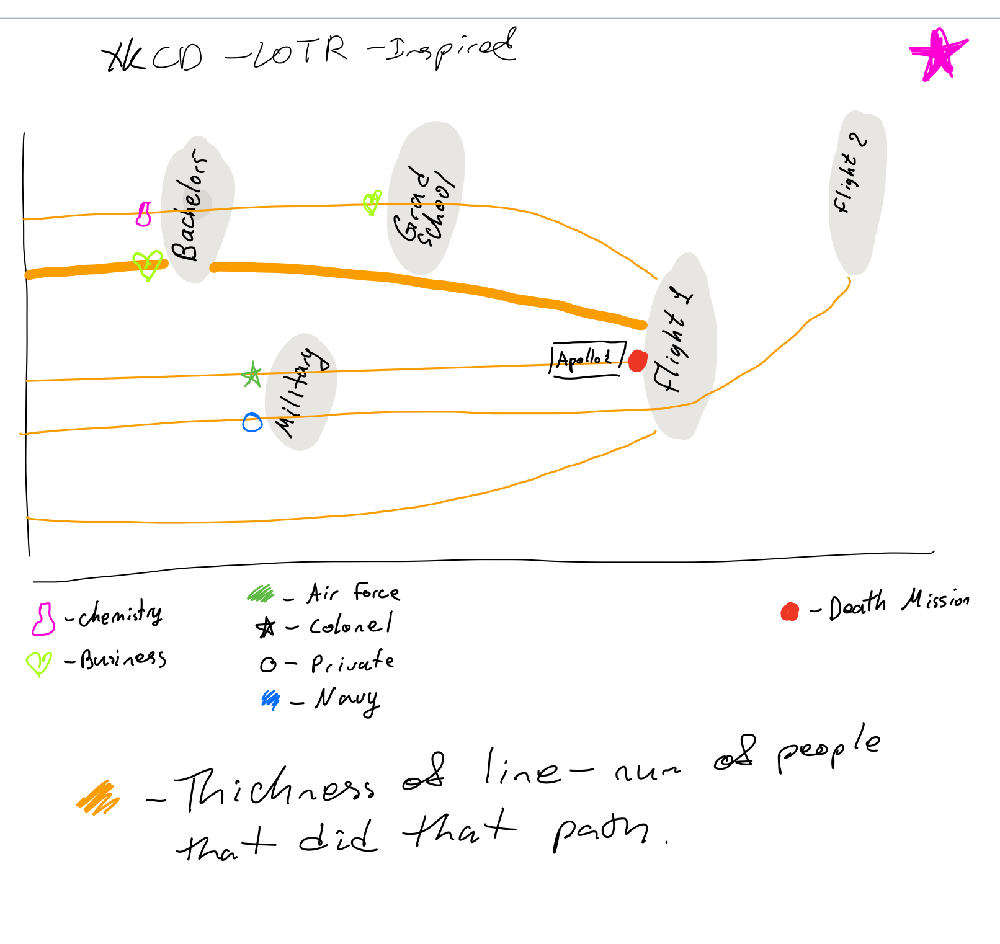
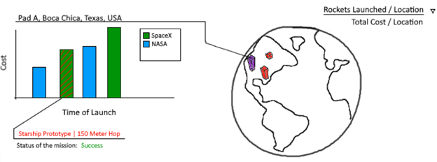

# Process Book

## Link to initial proposal:  https://docs.google.com/document/d/1ox2JzEldCwTgkCKxna-jLT34oJwoHd9bM_2vRIvY-AY/edit?usp=sharing

## Github repo: https://github.com/ekavtaradze/final/tree/main

## Working datasets:

https://www.kaggle.com/nasa/astronaut-yearbook  
Geo JSON files

## Idea Brainstorming Stage

---

At the start of the project, our group had a variety of ideas that we were interested in pursuing. While we had many
good choices, the one the entire group agreed on was some for of data visualization involving some from NASA Astronauts
and their space travels.

###     **Some of our brainstormed ideas can be seen down below.**

#### IDEA 1: How high can movies jump    
This project would very much be for entertainment value. A few areas to explore would be to see the average jump scare
over time, or movie rating and number of jump scares. We can also look at the type of scare (minor, major) and compare
that with the time between scares. "https://wheresthejump.com/full-movie-list/
Unfortunately, there will be quite a bit of data processing in the sense of collecting data from the website. T
here is a lot of information, but we might need to build a web scraper to collect all the .srt files in order to
extract all the information we need. Might also want to look into more datasets to find movie sales and cost that could
also be factored in."    Some timeline view would best suit the movies over the years, and it may be interesting to
select individual movies and compare their timeline scales with others. Could also compare movies by budget and use of
jump scares and rating.    The biggest challenge would be some form of web scraper to collect the necessary data to pull
something like this off.    

#### IDEA 2: The Usage of Social Media Across Different Age Groups
If we are not spending time on hw or with friends college students are likely on social media. Our group thought it may
be interesting to track how much time each different age group spends on the different type of social media, and a
specific respective service (snapchat, reddit, twitter....) This information could be used to help understand which
type of social media has the most usage in terms of people and time spent surfing."Currently, we would need to do some form
of data mining as there is not one large dataset that contains a lot of information that we would helpful to our mission.
But https://github.com/awesomedata/awesome-public-datasets#id92 has some interesting data that may be useful. "    
Bubble charts, bar charts, scatterplot graphs, and maybe network trees.Obviously this project will be difficult
if there is not any consistent data that can be used for creating the graph. Additionally, our group believes that
some of the information that we would need to complete this project may not be something that is easily accessible to
the public.

#### IDEA 3: ** Timeline of Astronauts in Space ** (Idea that was chosen)

This idea was inspired by the website https://www.howmanypeopleareinspacerightnow.com/
With this visualization, we would create a timeline to see how many people were in space on a certain date.
We are hoping to be able to add specific information about each astronaut.
Example: choose a date, such as Jan 1, 2017, and our visualization should be able to show you how many people were in
space at that time, and information about those astronauts. Astronaut Specific information is available as CSV and will
need virtually no transformation. For the space timeline, CSV includes information about every flight from 1957 - launch time, etc.
By joining these two datasets on mission names (missions flown by astronauts),
we will get the needed information about who was in space at what times.
The starter page shows how many people are in the space on the current date,
with their names listed at the bottom of the page. Hovering over the names will bring out more information about them.
At the top of the page, there is an option to change the date. Changing the date will show the corresponding number of
people in space and their information.

##### Modification - IDEA 3: Timeline of Astronauts in Space
Once our team came to a consensus about the topic we were interested, we began the process of acquiring datasets that captured
all the necessary information we wanted to display on the screen. It was at this point where we entered our first roadblock.
In our original plan, we thought it would be possible to visually encode three following items:
1. An astronauts career path
2. An astronauts mission
3. A timeline of space launches

Unfortunately, in the time that we had remaining, and the datasets that were available to us, the time required to properly
clean, and complete the datasets would not have left us enough time to complete the visualizations. And so, as a team we decided to
just focus on the astronauts career path. This simplified our data cleaning process to a degree and allowed us to go more
in depth on the careers path and look and see how the astronauts place of birth correlated to a specific career path.

## Planning our Visual Encoding

---
Once our group decided on the topic, we began thinking of unique ways that we could visually encode the data.
Here were some brainstorm sketches that our team came up with:

### Final Decision for Visual Encodings Choices
After taking some time to review our initial sketches, our group decides to strictly on the career path of the astronauts with
interaction being provided via a world map detailing the astronauts place of birth.

Once our group took some time to review our data set, we noticed that there was incredible diversity of career path between
astronauts, and a variety of places of birth. Our group realized there was no visualization that explored the different paths
taken by astronauts. So to fill this space we determined that our linked visualizations would incorporate a map and a Sankey diagram
to compare how the astronauts place of birth impacted their career path when working for NASA.

From class, we learned that map visualization is used to analyze and display the geographically related data. This form of
data is far more clear and intuitive. It makes easier to visually see the distribution or proportion of data in each region. As previously
mentioned our group thought it would be original and unique to see how NASA has gone global by recruiting astronauts from all across
the world. The decision to use a Sankey diagram was motivated by the groups aim at understanding the "path" or "link" seen
between the unique astronauts. Sankey diagrams help show the evolution of the path (in our case career path deviations). In addition,
Sankey diagrams also tell a story of where a data point comes to where it ends (in our case this is represented by the gender
and where their career took them).

#### Data - Cleaning and Manipulation
As mentioned previously, our data set contained information of the astronauts and some facts about his, or her, life before NASA (college education,
major, army background...). Not all of the information was particularly important when constructing our Sankey diagram. So we simply removed the
information that would not be represented in the Sankey diagram.

We extracted the locations of the birth cities via Excel. We applied the Geography data cast to the column with birth city names. Then, extracted the latitudes and longtitudes.
As for the map, one challenge that our group saw is that multiple astronauts were listed as being born in the same city. This
presented a challenge for us because if each point being projected on the map was a single astronaut, certain points would overlap.
So, we introduced a point offset for when describing the latitude and longitude if a particular city was the birthplace multiple astronauts.
In an .xsls file our group manipulated the lat and long values of a city by just enough to ensure that there was no overlap between points.

### Sources of Inspiration
- Inspired by the prof suggestion of XKCD LOTR diagram: https://xkcd.com/657/
- Interactive maps covered in class by Professor Harrison

### Issues Faced when Choosing Visual Encoding Strategy
One of the main challenges we faced while undertaking this task was finding a data set that properly incorporated all the
information our group wanted to present on the screen. As mentioned previously, our group changed the original viz scheme
in light of the struggles faced when joining multiple data sets.

## What Did our Visualization Teach Us?

---
### Learning outcomes from Sankey Diagram and Map
From our map our group noticed that almost all the astronauts were from the United States. Taking a deeper dive
we also see that the eastern half of the United States produces more NASA astronauts than the western half. In addition,
on the global scale of the map we see that there is minimal international representation within NASA. In addition, from
bare Sankey diagram we also see that there is a significant disparity's in the number of female astronauts in comparison to
male astronauts. Lastly, our group was surprised that so many of the astronauts were arriving to NASA from a military background.
While it makes sense, our group was still surprised.

## Conclusion

---
### Improvements
- Create a more in depth Sankey diagram that details the specific major that an astronauts studied for their
undergraduate and graduate degrees. It may be interesting to see the degree makeup of astronauts.

- Incorporate space programs other than NASA, to see the global domain of space agencies.  

- Incorporate the corresponding space missions associated with each astronaut.

### Limitations
- Some astronauts took a very specific path (or no path) which caused the lines of the Sankey diagram to be invisible (only 1px wide)
So, we decided to remove those from the Sankey diagram.

- When you select multiple astronauts on the map it is impossible to separate them on the Sankey diagram.

### Resources Used:
- Sankey - https://bl.ocks.org/d3noob/d0212d9bdc0ad3d3e45b40d6d012e455

- Gradient links: https://bl.ocks.org/micahstubbs/3c0cb0c0de021e0d9653032784c035e9
