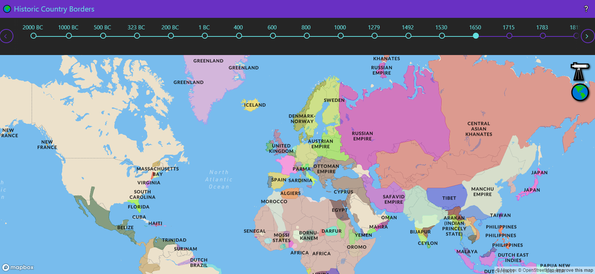
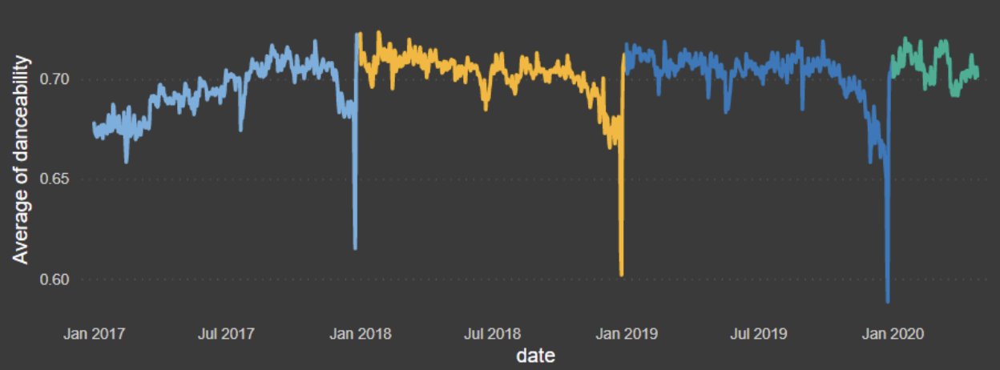
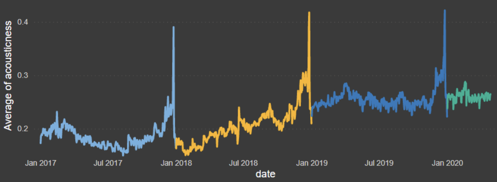
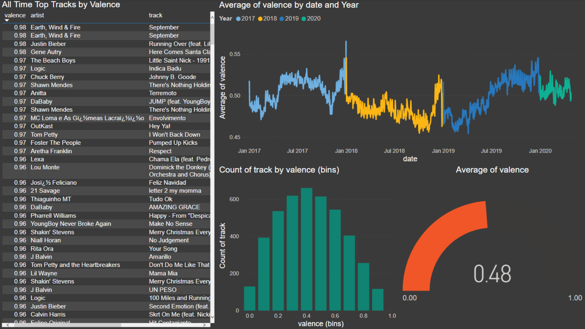
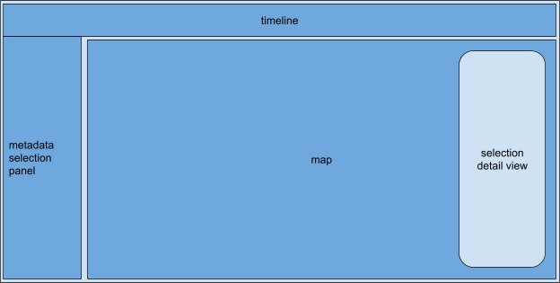
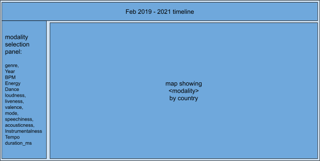
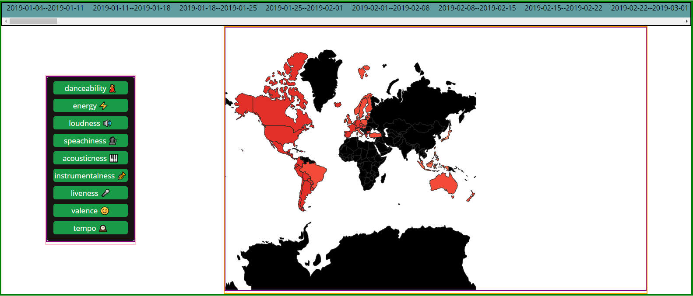
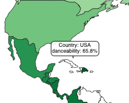
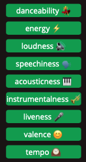

Process Book - Understanding Changing Trends in Spotify Streaming During COVID-19
===

Authors: Nicholas Alescio, Hunter Caouette, Clay Oshiro-Leavitt

Link: https://hcaouette.github.io/final/

Overview and Motivation
---
This project is an interactive visualization dashboard showing music trends on the popular streaming platform 'Spotify' for the past two years. This data was based on the weekly top 200 songs for each reported country. Each songs' metadata was averaged to produce a set of summary statistics for each week per country. 

We decided to tackle this project due to our common passion for music as well as the opportunity to include some in-depth data analysis and manipulation. We all have a data science background through the Data Science Minor as well as other coursework, so we decided that this would be an enjoyable way to illustrate our skills.

Related Work
---
As a group, we wanted to be able to visualize how the COVID-19 pandemic affected Spotify streaming on a global scale. For this, it made sense to consider the use of maps. One cool example of a map visualization we found was a map visualizing country borders over time. We ended up using this visualization to prototype the layout for our web page. (See it for yourself here: https://historicborders.app/) Our final design loosely followed the same layout, with a timeline across the top and a map (in our case a choropleth) below.

Questions
---
With COVID-19 running amok, we were curious to see if we could find any decernable trends in the type of music people were streaming. Furthermore, we were curious as to whether or not the location (different countries) impacted the style of music, as well as whether it would be possible to see the rollout of lockdowns across the world in the data.

Data
---

Our data consisted of the top 200 weekly Spotify songs from 55 countries over the past two years. Each song has associated metadata (known as audio features). Of these, we focused on 9: 
- danceability
- energy
- loudness
- speechiness
- acousticness
- instrumentalness
- liveness
- valence
- tempo

### Sources

- Spotify Data Catalogue (Web API pulls from here)
- Spotifycharts.com

### Scraping and Data Processing

To obtain our data, we wrote a scraping scripe in Python to repeatedly query the Spotifycharts.com webpage. Each query would return a CSV that we would then write to a file. Once we had our lists of songs, we stitched the separate CSVs into a single master 'songs' CSV. From this, we collapsed it into a smaller CSV of unique songs. Based on our unique songs, we used the track reference URL to pull the metadata for each track. We then created new files mapping our songs to the metadata, and were able to calculate summary statistics for each country's weekly top 200 songs. After this, we created a new JSON file that held each country's data keyed by the ISO3166 Alpha-3 country code. This format was then used by our visualization.

### Cleanup

Some responses from Spotifycharts.com returned an html page rather than a csv, which was unusable for our project. To clean our response data, we would check the first line of the data - if it was an html tag, we would omit it. Otherwise, we would use the data. Fortunately, this was the only data cleaning we had to do. 

Exploratory Data Analysis
---
We had previous explored some of these data attributes in a previous project, focusing on Spotify trends. From this, we already had some understanding of the audio features and how periodicity can impact the data. These previous visualizations were done using Microsoft Power BI.

  
  
 
Design Evolution
---
Initially, we were considering keeping the data local to one country. However, we all wanted to experiement with geospatial data representations and map/choropleth visualizations. Due to the granularity of the data (only resolves on the country level), we opted to expand our project to a global scale.

Because each song in Spotify has many normalized characteristics such as loudness (how loud a song is) and valence (how "happy" a song is), we wanted to make a visualization that could easily allow the viewer to see the differences in values for each of these characteristics for each country's top songs. We decided a color scale would work best to show these differences in values for each characteristic. Given that each country's top songs would be averaged together for each characteristic, we decided to make a choropleth map so as to best show these aggregate summaries. The idea here is that the user will be able to select a characteristic (modality) and a specific week from a timeline, and each country will average its top songs for the specified week to show the average value for that modality. Our hope for this is that we will be able to easily tell changes in average music valence, length, and so on over time, specifically over the course of the COVID-19 pandemic.

Our first layout prototype for our web page looked like this:

Rather than having a dedicated detail view panel, we decided tooltips would be more ideal, so we changed the layout prototype to this (and added some notes for each block's purpose):

Here was our initial implementation and testing of a choropleth map with a modality picker and timeline:

Implementation
---
For this project, we implemented a standard choropleth with each country shaded by its reported value for a week. Countries that had no reported data were left white. 

To provide more detail on the various countries, we implemented a hover-tooltip functionality that would list the ISO3166 Alpha-3 country code as well the country's audio feature value.

Our visualization allows the user to toggle between 9 different audio features. The definitions were sourced from the Spotify Developer API documentation (https://developer.spotify.com/documentation/web-api/reference/#object-audiofeaturesobject):
- danceability
  - Danceability describes how suitable a track is for dancing based on a combination of musical elements including tempo, rhythm stability, beat strength, and overall regularity. A value of 0.0 is least danceable and 1.0 is most danceable.
- energy
    - Energy is a measure from 0.0 to 1.0 and represents a perceptual measure of intensity and activity. Typically, energetic tracks feel fast, loud, and noisy. For example, death metal has high energy, while a Bach prelude scores low on the scale. Perceptual features contributing to this attribute include dynamic range, perceived loudness, timbre, onset rate, and general entropy.
- loudness
    - The overall loudness of a track in decibels (dB). Loudness values are averaged across the entire track and are useful for comparing relative loudness of tracks. Loudness is the quality of a sound that is the primary psychological correlate of physical strength (amplitude). Values typical range between -60 and 0 db.
- speechiness
    - Speechiness detects the presence of spoken words in a track. The more exclusively speech-like the recording (e.g. talk show, audio book, poetry), the closer to 1.0 the attribute value. Values above 0.66 describe tracks that are probably made entirely of spoken words. Values between 0.33 and 0.66 describe tracks that may contain both music and speech, either in sections or layered, including such cases as rap music. Values below 0.33 most likely represent music and other non-speech-like tracks.
- acousticness
  - A confidence measure from 0.0 to 1.0 of whether the track is acoustic. 1.0 represents high confidence the track is acoustic.
- instrumentalness
    - Predicts whether a track contains no vocals. “Ooh” and “aah” sounds are treated as instrumental in this context. Rap or spoken word tracks are clearly “vocal”. The closer the instrumentalness value is to 1.0, the greater likelihood the track contains no vocal content. Values above 0.5 are intended to represent instrumental tracks, but confidence is higher as the value approaches 1.0.
- liveness
    - Detects the presence of an audience in the recording. Higher liveness values represent an increased probability that the track was performed live. A value above 0.8 provides strong likelihood that the track is live.
- valence
    - A measure from 0.0 to 1.0 describing the musical positiveness conveyed by a track. Tracks with high valence sound more positive (e.g. happy, cheerful, euphoric), while tracks with low valence sound more negative (e.g. sad, depressed, angry).
- tempo
    - The overall estimated tempo of a track in beats per minute (BPM). In musical terminology, tempo is the speed or pace of a given piece and derives directly from the average beat duration.

These can be selected through the button list on the left hand side - a single audio feature can be selected at any one time. We recognize that these terms may not be familiar to all users, so we included an emoji alongside each name to provide a graphical representation of the term.

Along the top of the visualization is a scrollbar with a list of weeks. These weeks can be selected to change the portion of the dataset being viewed. The black box and red text indicates that a specific week has been selected.

Evaluation
---
One thing we learned about the data, specifically the values for the audio features, is that, when normalized, we saw some audio features having higher ranges than others (for example, danceability and acousticness have high ranges) and some audio features such as tempo have low ranges (little to no variation across the board).

Through this visualization, we learned that the audio features for top tracks vary greatly by country. For example, we learned that track danceability remains relatively constant in Japan over time, while danceability for the United States varied greatly (especially during the holidays - maybe Christmas music is just bad for dancing).

Our visualization works as we expected it to, however we wanted to add a feature that allowed the timeline to be automatically traversed from start to end, which would "animate" the choropleth map. Unfortunately we couldn't get this feature to work in time, but we recognize that it would definitely improve the visualization and better communicate to the viewer the changing trends in streaming over time.

Final Thoughts
---
We would like to thank professor Lane Harrison for all of his guidance on this project, especially for helping us out with the choropleth map.
