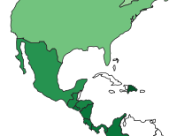

Process Book - Understanding Changing Trends in Spotify Streaming During COVID-19
===

Authors: Nicholas Alescio, Hunter Caouette, Clay Oshiro-Leavitt

Link: (insert link to GitHub pages here)

Overview and Motivation
---
This project is an interactive visualization dashboard showing music trends on the popular streaming platform 'Spotify' for the past two years. This data was based on the weekly top 200 songs for each reported country. Each songs' metadata was averaged to produce a set of summary statistics for each week per country. 

We decided to tackle this project due to our common passion for music as well as the opportunity to include some in-depth data analysis and manipulation. We all have a data science background through the Data Science Minor as well as other coursework, so we decided that this would be an enjoyable way to illustrate our skills.

Related Work
---
Anything that inspired you, such as a paper, a web site, visualizations we discussed in class, etc.

Questions
---
What questions are you trying to answer? How did these questions evolve over the course of the project? What new questions did you consider in the course of your analysis?

Data
---
insert data discussion here

### Sources

Spotifycharts.com

### Scraping

insert scraping method(s) here

### Cleanup

insert cleanup method(s) here

Some responses from Spotifycharts.com returned an html page rather than a csv, which was unusable for our project. To clean our response data, we would check the first line of the data - if it was an html tag, we would omit it. Otherwise, we would use the data. Fortunately, this was the only data cleaning we had to do. 

Exploratory Data Analysis
---
What visualizations did you use to initially look at your data? What insights did you gain? How did these insights inform your design?

Design Evolution
---
What are the different visualizations you considered? Justify the design decisions you made using the perceptual and design principles you learned in the course. Did you deviate from your proposal?

Initially, we were considering keeping the data local to one country. However, we all wanted to experiement with geospatial data representations and map/choropleth visualizations. Due to the granularity of the data (only resolves on the country level), we opted to expand our project to a global scale. 

Implementation
---
Describe the intent and functionality of the interactive visualizations you implemented. Provide clear and well-referenced images showing the key design and interaction elements.

For this project, we implemented a standard choropleth with each country shaded by its reported value for a week. Countries that had no reported data were left white. 

To provide more detail on the various countries, we implemented a hover-tooltip functionality that would list the ISO3166 Alpha-3 country code as well the country's mode value.

Our visualization allows the user to toggle between 9 different modes:
- danceability
- energy
- loudness
- speechiness
- acousticness
- instrumentalness
- liveness
- valence
- tempo

These can be selected through the button list on the left hand side - a single mode can be selected at any one time. We recognize that these terms may not be familiar to all users, so we included an emoji alongside each name to provide a graphical representation of the term.

Along the top of the visualization is a scrollbar with a list of weeks. These weeks can be selected to change the portion of the dataset being viewed. The black box and red text indicates that a specific week has been selected.

Evaluation
---
What did you learn about the data by using your visualizations? How did you answer your questions? How well does your visualization work, and how could you further improve it?

Conclusion
---
insert concluding thoughts here
